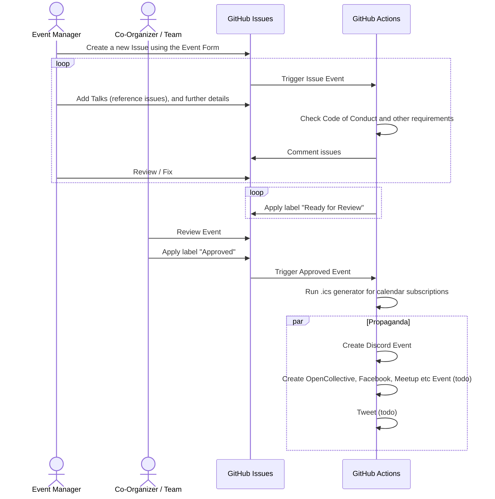

# Chat & Support

[Join on Discord](https://discord.gg/m6cphasp4z)

### How It Works

```mermaid
sequenceDiagram
    actor EM as Event Manager
    actor CO as Co-Organizer / Team
    participant GI as GitHub Issues
    participant GA as GitHub Actions

    EM->>GI: Create a new Issue using the Event Form
    loop
    GI->>GA: Trigger Issue Event
    EM->>GI: Add Talks (reference issues), and further details
    GA->>GA: Check Code of Conduct and other requirements
    GA->>GI: Comment issues
    EM->>GI: Review / Fix
    end
    loop
    GA->>GI: Apply label "Ready for Review"
    end
    CO->>GI: Review Event
    CO->>GI: Apply label "Approved"
    GI->>GA: Trigger Approved Event
    GA->>GA: Run .ics generator for calendar subscriptions
    par Propaganda
    GA->>GA: Create Discord Event
    GA->>GA: Create OpenCollective, Facebook, Meetup etc Event (todo)
    GA->>GA: Tweet (todo)
    end
```
