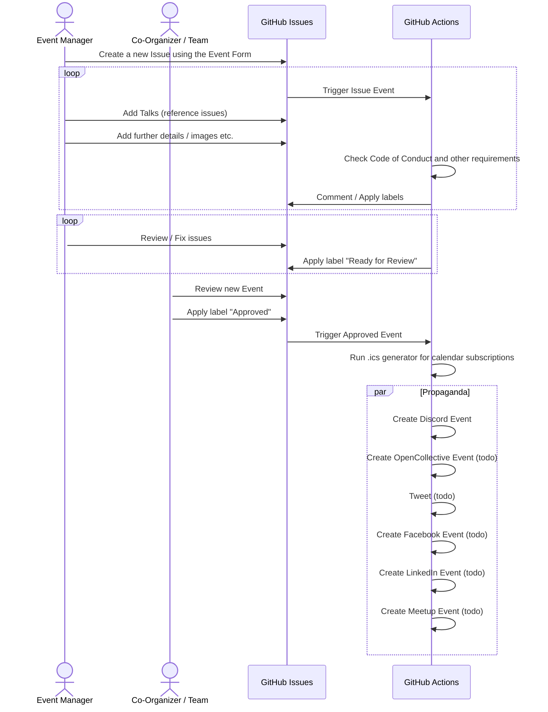

## GitEvents - Event Management meets Issue Ops

https://gitevents.org

- 🌈 Open & Inclusive Organization
- :octocat: Manage Events, Talks, Suggestions etc. with GitHub Issues
- 🧑‍💻 GitHub GraphQL backend to feed your own website
- 🤖 Automation with GitHub Actions
- 🙈 No databases, admin management, etc.

### Active Actions/Plugins

- 🌈 [Inclusive Org](https://github.com/gitevents/inclusive-org) - every
  interaction with a repo (comment, reaction, discussion, push, etc.) triggers
  an invite to join the GitHub Organization
- 📆 [GitEvents ICS](https://github.com/gitevents/ics) - create a `.ics` file
  for calendar subscriptions (in Apple/Google/etc. Calendar)
- 🤖 [GitEvents Action](https://github.com/gitevents/action) - manage issues
  (code-of-conduct check, etc.), labels etc.
- 🤖 [GitEvents Propaganda](https://github.com/gitevents/propaganda) - propagate
  / spread event to other platforms and sites

### Chat, Discussion & Support

👩‍💻 [Join on Discord](https://discord.gg/m6cphasp4z)

### How It Works

